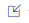

<!-- loioeb8249323b7041d0ae7b670d064833ce -->

# Exporting and Importing Scenarios

Transfer machine learning scenarios between systems by exporting and importing scenario versions as ZIP files, including pipelines and notebooks.

<a name="loioeb8249323b7041d0ae7b670d064833ce__prereq_yrc_tds_cpb"/>

## Prerequisites

You have installed the System Management Command-Line Client \(vctl\). For more information, see [System Management Command-Line Client Reference for SAP Data Intelligence](https://help.sap.com/viewer/41b069490705457e9426b112a3f052bd/Cloud/en-US/b13e0b4fe2574b3881e3c7ef1ad2a640.html "The System Management Command-Line Client Reference for SAP Data Intelligence contains information about the commands that SAP Data Intelligence provides for use with the SAP Data Intelligence System Management Command-Line Client.") :arrow_upper_right:.

## Context

You can export a version of a machine learning scenario from one system \(such as your development system\) and import it into another system \(such as your test, quality, or production system\). In this way, you can make sure that your scenarios are changed only in your development systems. You can, however, still change the scenarios in your target systems if necessary.

You export a scenario version as a ZIP file, which contains the pipelines and notebooks from the scenario. Note that the export and import process handles notebooks and pipelines only. External dependencies such as customer operators, subengines, Docker files, and Docker images are not supported. Executions, deployments, and artifacts are also not included.

> ### Caution:  
> Do not import any scenarios that you exported prior to June 2020. For more information, see SAP Note [2932880](https://me.sap.com/notes/2932880).

<a name="loiodd18798fc0f34d25ab3cdaac4bdb0043"/>

<!-- loiodd18798fc0f34d25ab3cdaac4bdb0043 -->

## Exporting a Scenario Version

Export a closed version of a machine learning scenario by using the System Management Command-Line Client \(vctl\) to download the solution as a ZIP file. Requires the scenario ID and solution name.

<a name="loiodd18798fc0f34d25ab3cdaac4bdb0043__context_vqc_2fs_cpb"/>

## Context

When you create a version of a scenario, it is exported to the solution repository that was defined in the source cluster. You can export a version of your scenario by finding the solution name and downloading it using the System Management Command-Line Client \(vctl\).

> ### Note:  
> You can only export a scenario version that is closed. In other words, you cannot export a draft scenario.

## Procedure

1.  Copy the scenario ID from the URL of your scenario version.

    The scenario ID is shown after “scenarios”: <code><i class="varname">&lt;base URL&gt;</i>/app/ml-scenario-manager/#/scenarios/<i class="varname">&lt;scenario ID&gt;</i>/versions/<i class="varname">&lt;version&gt;</i>/EndColumnFullScreen</code>.

2.  Find the name of the solution as follows:

    1.  Open the *System Management* app and click the *Tenant* tab.

    2.  Search for the scenario ID.

        You will see one solution for each version of your ML scenario.

    3.  Copy the name of the solution from the header area.

3.  Open the System Management Command-Line Client \(vctl\) and sign in to your tenant using the command <code>vctl login <i class="varname">&lt;base URL&gt;</i> <i class="varname">&lt;tenant name&gt;</i> <i class="varname">&lt;user name&gt;</i> '<i class="varname">&lt;password&gt;</i>'</code>.

    > ### Example:  
    > `vctl login https://source.system.abc.hana.ondemand.com/ default manager 'LetMe1n'`

4.  Download the solution as a ZIP file using the command <code>vctl solution download <i class="varname">&lt;solution name&gt;</i> '<i class="varname">&lt;version&gt;</i>'</code>

    Note that the version must always have the format n.n.n.

    > ### Example:  
    > `vctl solution download ml_scenario_default_f4cafbb1-1cf2-49e7-b15c-eafa88724115 '2.0.0'`

<a name="loio9e458b89d55a438da06220c52f54cdbf"/>

<!-- loio9e458b89d55a438da06220c52f54cdbf -->

## Importing a Scenario Version

Import a scenario version by navigating to the Files tab in the System Management app, selecting the Import Solution option, and choosing the previously downloaded ZIP file. The imported scenario version will be uploaded to the target system and accessible in the ML Scenario Manager app.

## Procedure

> ### Note:  
> You cannot import a scenario version to a system/cluster if:
> 
> -   The scenario version already exists in the system/cluster.
> 
> -   The scenario version previously existed in the system/cluster but has since been deleted.

1.  Open the *System Management* app and switch to the *Files* tab.

2.  On the *Union View* tab, click *Import file or solution* \(\) and choose *Import Solution*.

3.  Select the ZIP file that you downloaded previously.

<a name="loio9e458b89d55a438da06220c52f54cdbf__result_b2b_xqs_4qb"/>

## Results

Your scenario version is uploaded to the target system and is available in the *ML Scenario Manager* app.

