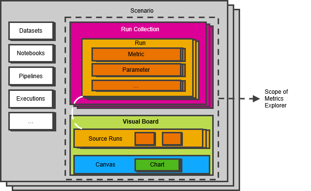

<!-- loio71e42ac78f45447b84fe4d53b5ab75a8 -->

# Metrics Explorer

The metrics explorer lets you view the metrics and parameters that apply to each run of your ML scenario. You can view the data for a specific run or you can compare data across runs.

You capture metrics from a notebook or pipeline in your machine learning scenario under different runs. Runs can be grouped logically into run collections on any basis that you choose to define. For example, one run collection may contain runs that use a random forest algorithm and another may contain runs that use a lasso regression algorithm. Another example could be grouping runs into run collections based on the datasets that are used.

The SDK enables you to record metrics and parameters in the form of runs and group them into run collections. The metrics explorer then lets you browse the runs and run collections to view the recorded metrics and parameters, as well as to compare the data from different runs.

> ### Note:  
> The Submit Metrics operator also provides a simplified option to submit metrics. However, we recommend that you use the SDK.

<a name="loio71e42ac78f45447b84fe4d53b5ab75a8__section_e1k_2pn_pkb"/>

## Concepts Used in the Metrics Explorer

### Run Collection

A run collection allows you to logically group a number of runs. You can generate run collections by using the tracking functionality of the Python SDK.

When you log runs using the tracking functionality, you can specify a name for your run collection. If you don't specify a name, the system creates a default run collection for each source \(that is, notebook or pipeline\). The name of the default run collection is the same as that of the source. These default run collections are shown in the metrics explorer with "\(Default\)" appended at the end.

> ### Example:  
> You are using a Jupyter notebook called “abc” to log runs. You log a few runs with a run collection called “RC1”. You then log a few more runs in a run collection without a name. For the first set of runs, a run collection called “RC1” is created. For the second set of runs, the system creates a default run collection with the name “abc”. In total, two run collections are created.

When you create a run collection, we recommend that you do not include runs from more than one source \(notebook or pipeline\) in a run collection.

### Run

A run is an instance of a machine learning experiment. Each run consists of metrics and parameters from one iteration of a machine learning experiment, along with the associated tags and labels.

### Metrics

Metrics are used to measure the performance of your machine learning model. Different metrics are used to evaluate different machine learning models. For example, log loss or average accuracy could be used to evaluate a classification task, whereas mean absolute error or root mean square error \(RMSE\) could be used to evaluate a model that provides a numeric output.

### Parameters

Parameters are the variables in your machine learning model.

### Datasets

A collection of data presented as a table. Rows represent instances of business objects, and columns represent the values of those instances.

### Notebooks

Documents that contain Python code that can be run as part of data analysis, as well as rich-text elements that can be easily read by humans.

### Pipelines

A pipeline is a step-by-step process to execute specific activities, such as data extraction, data transformation, training, or model serving.

### Executions

An execution is a pipeline that runs and creates a specific output. For example, a training pipeline usually generates machine learning models, and data transformation pipelines create data sets.

### Visual Board

The visual board lets you compare runs from one or more run collections. It is generated using runs that are considered to be “source runs”. The data from the source runs is shown in tabular format on the *Data* tab of the visual board. You can use the canvas to create charts from the metrics and parameters of the source runs and compare them visually.

### Canvas and Charts

The canvas is the part of the visual board where you can add charts to compare the source runs graphically. For example, you can plot a metric against a run ID, parameter, or timestamp.

### Source Runs

In the context of the visual board, source runs refer to specific runs that are considered as the basis or reference for comparison. These runs are selected to provide the data for generating charts and visualizations on the visual board.

The scope of the visual board is restricted to these source runs.

### Scenario

A machine learning scenario is a collection of design-time elements such as pipelines and Jupyter notebooks, and run-time elements such as training runs, models, and model deployments. A scenario is the primary point of entry when working on machine learning projects.

<a name="loio71e42ac78f45447b84fe4d53b5ab75a8__section_cl1_fdw_xkb"/>

## See the Metrics Explorer in Action

The following video shows how you can use the Metrics Explorer to view run details and compare data from different runs.

-   **[Browsing Run Collections and Runs](browsing-run-collections-and-runs-7ba13f1.md "You can use the metrics explorer to view the metrics and parameters that were applied to
		a specific run.")**  
You can use the metrics explorer to view the metrics and parameters that were applied to a specific run.
-   **[Comparing Runs](comparing-runs-b81ccec.md "The metrics explorer lets you compare runs using the visual board. You can view run data
		in a table or create charts to analyze them graphically.")**  
The metrics explorer lets you compare runs using the visual board. You can view run data in a table or create charts to analyze them graphically.

**Related Information**  

[Using the Tracking Functionality](../using-the-sdk-to-track-metrics-3d4d373.md#loio3d4d3738ed194d00a3493ece0beacd92__section_ysf_sqs_d3b)

[Submit Metrics](https://help.sap.com/viewer/9182d964573745e89f523395d7c43e53/Dev/en-US/b792d72b009a41b090c896d374a4dc17.html "The Submit Metrics operator submits your model metrics to the ML Tracking API. The metrics can be viewed in ML Scenario Manager.") :arrow_upper_right:

