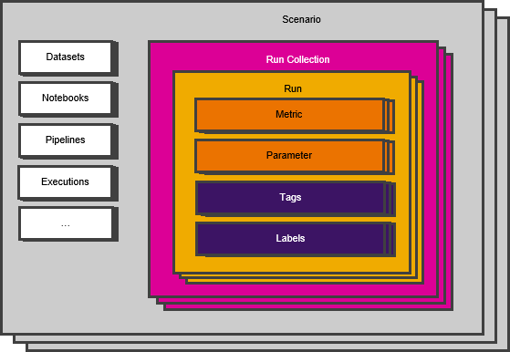

<!-- loio8d8c69fcb2e8485880b2803354f634ad -->

# Runs and Run Collections

Run collections allow you to logically group a number of runs. Runs are instances of a machine learning experiment, consisting of metrics and parameters from one iteration, along with the associated tags and labels.

### Scenario

A machine learning scenario is a collection of design-time elements such as pipelines and Jupyter notebooks, and run-time elements such as training runs, models, and model deployments. A scenario is the primary point of entry when working on machine learning projects.

### Run Collection

A run collection allows you to logically group a number of runs. You can generate run collections by using the tracking functionality of the Python SDK.

When you log runs using the tracking functionality, you can specify a name for your run collection. If you don't specify a name, the system creates a default run collection for each source \(that is, notebook or pipeline\). The name of the default run collection is the same as that of the source. These default run collections are shown in the metrics explorer with "\(Default\)" appended at the end.

> ### Example:  
> You are using a Jupyter notebook called “abc” to log runs. You log a few runs with a run collection called “RC1”. You then log a few more runs in a run collection without a name. For the first set of runs, a run collection called “RC1” is created. For the second set of runs, the system creates a default run collection with the name “abc”. In total, two run collections are created.

When you create a run collection, we recommend that you do not include runs from more than one source \(notebook or pipeline\) in a run collection.

### Run

A run is an instance of a machine learning experiment. Each run consists of metrics and parameters from one iteration of a machine learning experiment, along with the associated tags and labels.

### Metrics

Metrics are used to measure the performance of your machine learning model. Different metrics are used to evaluate different machine learning models. For example, log loss or average accuracy could be used to evaluate a classification task, whereas mean absolute error or root mean square error \(RMSE\) could be used to evaluate a model that provides a numeric output.

### Parameters

Parameters are the variables in your machine learning model.

### Tags

Tags are user-defined properties that are associated with a run. Each tag is a key-value pair of type `string`. Runs can also be filtered by tags.

### Labels

Labels are a set of key-value pairs that are associated with a run. They can be used to store semantic data or UI formatting data. Runs cannot be filtered by labels.

### Datasets

A collection of data presented as a table. Rows represent instances of business objects, and columns represent the values of those instances.

### Notebooks

Documents that contain Python code that can be run as part of data analysis, as well as rich-text elements that can be easily read by humans.

### Pipelines

A pipeline is a step-by-step process to execute specific activities, such as data extraction, data transformation, training, or model serving.

### Executions

An execution is a pipeline that runs and creates a specific output. For example, a training pipeline usually generates machine learning models, and data transformation pipelines create data sets.

