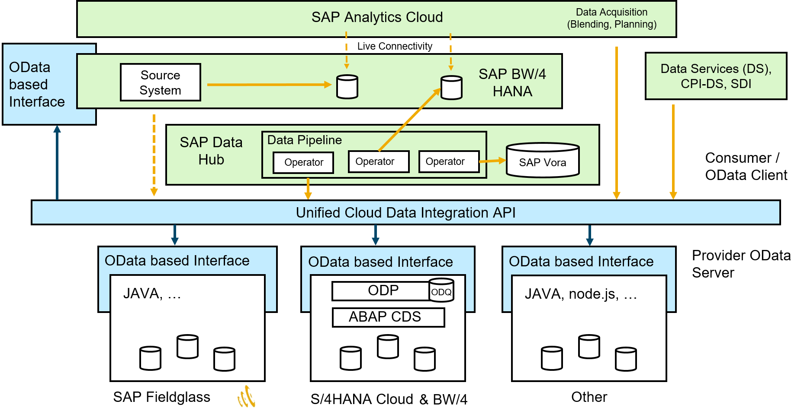
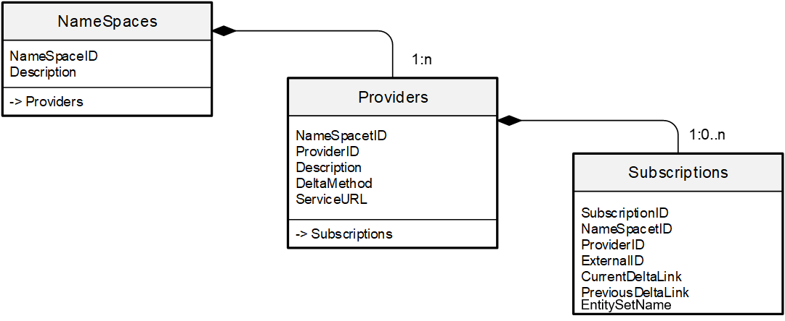
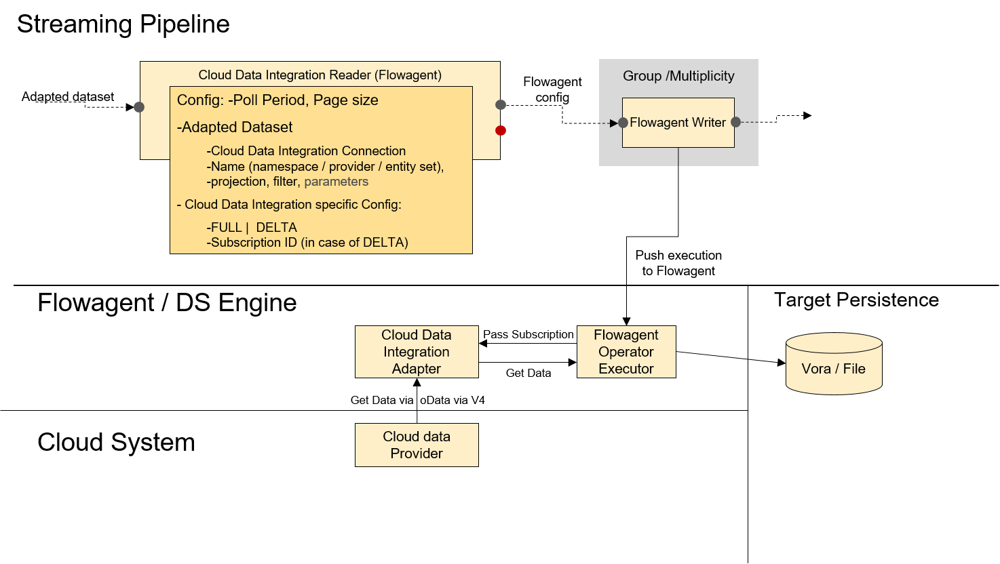

<!-- loiod6a8144e272e43cfb104888a47d29cef -->

# Integrating SAP Cloud Applications with SAP Data Intelligence

SAP Data Intelligence enables you to integrate SAP cloud applications with SAP Data Intelligence for holistic data management. The integration is supported using the Cloud Data Integration API, which is based on the OData V4 specifications.

**SAP Cloud Application Data Integration – Providers and Consumers ​**

<a name="loiod6a8144e272e43cfb104888a47d29cef__section_znp_mc1_hhb"/>

## Cloud Data Integration API

SAP cloud applications implement the Cloud Data Integration API, which consists of two types of OData services. The first type is the Administrative service that exists once per system. The structure of the administrative service is as below.

The administrative service provides a catalog of providers that are organized along namespaces. Each provider represents a business object and consists of one more entity sets that semantically belong together.

> ### Note:  
> Every implementation must produce the same $metadata.

The second type of service exists once per data provider, and the structure of these providers depends on the entity sets of the provider. This service provides access to the metadata and the data of the entity sets.

In the current version, you can integrate the following SAP Cloud applications with SAP Data Intelligence.

-   SAP Fieldglass
-   SAP Sales Cloud
-   SAP Service Cloud

<a name="loiod6a8144e272e43cfb104888a47d29cef__section_r1x_wh1_hhb"/>

## Creating a Connection

In the SAP Data Intelligence Connection Management application, you can use the connection type, CLOUD\_DATA\_INTEGRATION to create connections to SAP Cloud applications. In the connection definition, configure the service endpoints. For more information see, [CLOUD_DATA_INTEGRATION](https://help.sap.com/viewer/300d97f4d57c4b329df8c83858ff67fb/Dev/en-US/ff10e8a1238c41898ae9008b893538c5.html "The CLOUD_DATA_INTEGRATION connection type connects to and accesses information from systems that provide OData-based APIs for data integration with SAP Data Intelligence and SAP BW/4 HANA.") :arrow_upper_right:

<a name="loiod6a8144e272e43cfb104888a47d29cef__section_jpd_131_hhb"/>

## Capabilities

Creating a connection to an SAP Cloud application enables you to use entity sets of the service providers as datasets in the Metadata explorer. Additionally, the connection also maps the namespaces and providers to folders in the Metadata Explorer. As a result, you can view the metadata of entity sets and preview them in the Metadata Explorer application.

You can use the Cloud Data Integration Operator in the SAP Data Intelligence Modeler for data ingestion. For more information see, [Cloud Data Integration Consumer](https://help.sap.com/viewer/9182d964573745e89f523395d7c43e53/Dev/en-US/f1f6af01992145e288970f956aae5da9.html "The Cloud Data Integration Consumer operator (com.sap.dh.cloud_data_integration) is implemented in the subengine model and uses Flowagent for execution. To effectively read from it, it is necessary to connect this operator to a Flowagent-based producer operator (for example, Flowagent File Producer).") :arrow_upper_right:

The following graphical representation shows a snapshot of streaming replications using the Flowagent.

