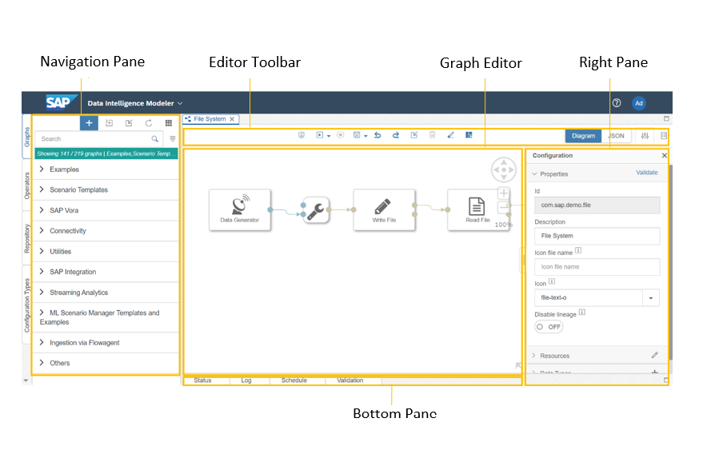

<!-- loio8516038715594a219bb3605bba07b91d -->

# Description of the Modeler Main Screen

Use the areas of the SAP Data Intelligence Modeler main screen to perform various tasks, such as configuring a graph.

The following image shows the various areas of the Modeler main screen.

The following table describes the areas of the Modeler main screen.

<table>
<tr>
<th valign="top">

Pane or Toolbar

</th>
<th valign="top">

Description

</th>
</tr>
<tr>
<td valign="top">

Graph editor

</td>
<td valign="top">

Area in which you add and connect operators for a graph.

</td>
</tr>
<tr>
<td valign="top">

Navigation pane

</td>
<td valign="top">

Consists of the tabs described in the following table.

<table>
<tr>
<th valign="top">

Tab

</th>
<th valign="top">

Description

</th>
</tr>
<tr>
<td valign="top">

*Graphs*

</td>
<td valign="top">

Access built-in or custom graphs, and create custom graphs.

</td>
</tr>
<tr>
<td valign="top">

*Operators*

</td>
<td valign="top">

Access built-in or custom operators, and create custom operators.

</td>
</tr>
<tr>
<td valign="top">

*Repository*

</td>
<td valign="top">

Access and create Modeler objects, such as graphs, operators, and types in your repository. Create new folders, import auxiliary files or solutions, and export folders as `.tgz` files or vSolution files.

> ### Note:  
> The Modeler provides individual Dockerfiles to create containerized environments for the operator groups. The Modeler selects the Dockerfiles using a tag-matching mechanism.

</td>
</tr>
<tr>
<td valign="top">

*Configuration Types*

</td>
<td valign="top">

Access all type definitions or create new types.

</td>
</tr>
<tr>
<td valign="top">

*Data Types*

</td>
<td valign="top">

Create data types that define structures for input data streams, which you can use in further processing steps in the pipeline.

</td>
</tr>
</table>

</td>
</tr>
<tr>
<td valign="top">

Bottom pane

</td>
<td valign="top">

Consists of the following tabs:

-   *Status*: Monitor the status of the graph.
-   *Log*: Run trace messages based on severity levels.
-   *Schedule*: Monitor graph schedules.
-   *Validation*: Validate your graph to find errors.

</td>
</tr>
<tr>
<td valign="top">

Editor toolbar

</td>
<td valign="top">

-   Perform operations on the graph in the graph editor, such as save and run a graph.
-   Define the configuration parameters for the graph, groups, and operators.
-   View details about various operators, including example graphs that the application provides.

</td>
</tr>
</table>

**Related Information**  

[Creating Graphs](../using-graphs/creating-graphs/creating-graphs-aea42f8.md "A graph (pipeline) consists of operators that you configure to form a specific process and connect using input and output ports.")

[Creating Operators](../using-operators/creating-operators-049d2f3.md "Use the SAP Data Intelligence Modeler to create your own operators to use in graphs (pipelines).")

[Creating Dockerfiles](../creating-dockerfiles/creating-dockerfiles-62d1df0.md "Dockerfiles contain all commands that you call on a command line to assemble a docker image.")

[Monitor the Graph Execution Status](../using-graphs/monitor-the-graph-execution-status-610a01b.md "After creating and executing a graph, you can monitor the status of the graph execution in the SAP Data Intelligence application.")

[Creating Configuration Types](../creating-configuration-types-2e63e4c.md "Configuration types are JSON files that allow you to define properties and bind them with data types. You can also associate the properties with certain validations, define its UI behavior, and more.")

[Error Recovery with Generation 2 \(Gen2\) Pipelines](../using-graphs/error-recovery-with-generation-2-gen2-pipelines-1cd3efb.md "Gen2 pipelines (graphs) make it possible to recover from errors using specific runtime features.")

