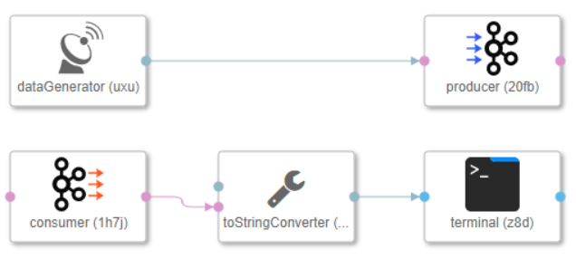
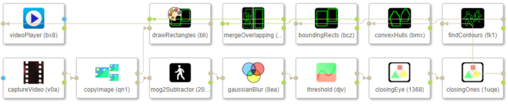

<!-- loiof003a9f0eea3439488202faeb5ef6d5f -->

# Introduction to the SAP Data Intelligence Modeler

The SAP Data Intelligence Modeler application is based on the Pipeline Engine, which uses a flow-based programming model to run graphs that process your data.

<a name="loiof003a9f0eea3439488202faeb5ef6d5f__section_zvv_mjy_ryb"/>

## Data Ingestion and Transformation

The Modeler offers advanced data ingestion and transformation capabilities using computation graphs. In computation graphs, nodes represent operations on the data and edges represent the data flow. The following are common use cases for data ingestion and transformation in the Modeler:

-   Ingest data from source systems like the following:
    -   Database systems, such as SAP HANA.
    -   Message queues, such as Apache Kafka.
    -   Data storage systems, such as Hadoop Distributed File System \(HDFS\) or Amazon Simple Storage Service \(Amazon S3\).

-   Cleanse data.
-   Transform data to target schemas.
-   Store data in target systems for consumption, archiving, or analysis.
-   Replicate large datasets.

### Modeler Graphical Capabilities

Use the graphical capabilities of the Modeler to create graphs, and use the runtime component to run graphs in a containerized environment that runs on Kubernetes. Construct graphs in the Modeler using predefined operators, which provide for many productive business use cases. These operators help define graphs, including nonterminating, nonconnected, or cyclic graphs.

> ### Example:  
> **A simple interaction with Apache Kafka**
> 
> The following graph consists of two subgraphs:
> 
> -   The first subgraph generates data and writes the data into a Kafka message queue.
> -   The second subgraph reads the data from Kafka, converts it to string, and prints the data to a terminal.
> 
> 

Also use the Modeler to create generic data processing graphs, as shown in the following example.

> ### Example:  
> The following graph detects objects in a video stream.
> 
> 

-   **[Log on to SAP Data Intelligence Modeler](log-on-to-sap-data-intelligence-modeler-089df27.md "You can access the SAP Data Intelligence Modeler
		from the SAP Data Intelligence Launchpad or launch it
		directly with a stable URL.")**  
You can access the SAP Data Intelligence Modeler from the SAP Data Intelligence Launchpad or launch it directly with a stable URL.
-   **[Description of the Modeler Main Screen](description-of-the-modeler-main-screen-8516038.md "Use the areas of the SAP Data Intelligence Modeler
		main screen to perform various tasks, such as configuring a graph.")**  
Use the areas of the SAP Data Intelligence Modeler main screen to perform various tasks, such as configuring a graph.

