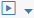

<!-- loio06b0159614304cc7acc1a278ca0e094b -->

<link rel="stylesheet" type="text/css" href="../css/sap-icons.css"/>

# Debug Graphs

You can start the graph in debug mode to verify the input and output from each operator during execution and analyze or modify the data passing through a connection.

<a name="loio06b0159614304cc7acc1a278ca0e094b__context_ek3_45z_yrb"/>

## Context

Debug mode enables debugging capabilities on the execution of a pipeline and allows you to investigate the whole pipeline step by step to make it bug free. You can inspect data at a specific stage of a pipeline execution, detect data quality issues, perform a root cause analysis of the detected problems, and try corrective actions.

> ### Note:  
> The debug feature is not supported for generation 1 graphs with structured data operators.

<a name="loio06b0159614304cc7acc1a278ca0e094b__steps_fk3_45z_yrb"/>

## Procedure

1.  In the graph editor, open the graph that you want to debug.

2.  In the editor toolbar, choose the  \(Debug\) menu option.

    The graph executes in debug mode.

3.  To view the debugging status of the graph, open the *Status* tab in the bottom panel and select the graph to open it in the monitoring/runtime view.

    In the runtime view, the *Debug Panel* opens and lists all the breakpoints in the graph. You can select a specific operator in the graph to see the breakpoints associated with that operator.

4.  To filter the results in the debug panel, click  and choose from one of the following:

    -   *Breakpoint*: Displays only breakpoints.
    -   *Hit*: Displays breakpoints and streaming points that are hit.
    -   *Streaming*: Displays only streaming points.

-   **[Add Breakpoints to a Graph](add-breakpoints-to-a-graph-a8d10fd.md "Breakpoints and streaming points allow you to inspect the data transformation occurring
		throughout the pipeline when you run in Debug mode.")**  
Breakpoints and streaming points allow you to inspect the data transformation occurring throughout the pipeline when you run in *Debug* mode.

**Parent topic:**[Running Graphs](running-graphs-439d0a0.md "After creating a graph, you can run the graph based on the configuration defined for the graph. The Modeler application runs the operators in the graph as individual processes.")

**Related Information**  

[Automatic Graph Recovery](automatic-graph-recovery-4bf172b.md "Configure any graph to recover from failure automatically, regardless of whether the graph uses Generation 1 or Generation 2 operators.")

[Parameterize the Graph Run Process](parameterize-the-graph-run-process-f3caf16.md "Parameterize the graph run process using parameters that assume different values based on the values passed in each graph run.")

[Schedule Graph Executions](schedule-graph-executions-cb46d5f.md "The SAP Data Intelligence Modeler provides capabilities to schedule graph executions.")

