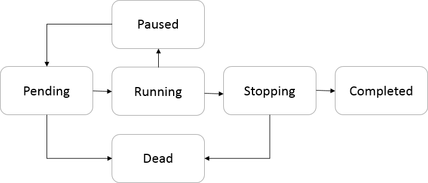

<!-- loio090bce6f1cb041adb4863b1ede74c737 -->

# Graph Status

When you create a graph, each graph is associated with a graph status, which may vary with time and can be manipulated with operations on the graph.

The table lists the possible graph status. You can view the status of the graph in the *Status* tab.

<table>
<tr>
<th valign="top">

Status

</th>
<th valign="top">

Description

</th>
</tr>
<tr>
<td valign="top">

Pending

</td>
<td valign="top">

Graph is being prepared for execution. Initial status.

</td>
</tr>
<tr>
<td valign="top">

Running

</td>
<td valign="top">

Graph is currently running.

</td>
</tr>
<tr>
<td valign="top">

Paused

</td>
<td valign="top">

Graph is currently paused and can be resumed later.

</td>
</tr>
<tr>
<td valign="top">

Stopping

</td>
<td valign="top">

Graph execution is stopping.

</td>
</tr>
<tr>
<td valign="top">

Completed

</td>
<td valign="top">

Graph terminated successfully.

</td>
</tr>
<tr>
<td valign="top">

Dead

</td>
<td valign="top">

Graph terminated abnormally because one or more operators in the graph failed.

</td>
</tr>
<tr>
<td valign="top">

Unknown

</td>
<td valign="top">

Status of graph is unknown. Indicates internal problems.

</td>
</tr>
</table>

Initially, the graph has pending status, that is, the graph is being prepared for execution. Pending status stays until either an error occurs, or the status of all subgraphs in graph is running.

The following image depicts the potential graph transition status.

If an error occurs during the running status, the graph allocation \(and hence the overall graph\) changes to dead. If all subgraphs terminate successfully, the graph status changes to completed.

**Related Information**  

[Monitor the Graph Execution Status](monitor-the-graph-execution-status-610a01b.md "After creating and executing a graph, you can monitor the status of the graph execution in the SAP Data Intelligence application.")

