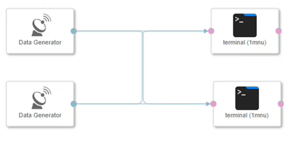
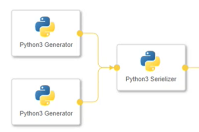
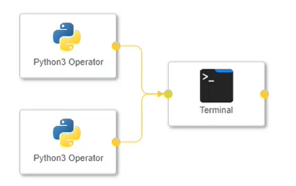
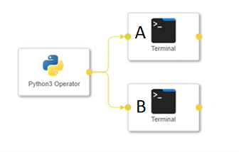

<!-- loio316c063414f84dcd9d6bf687b8f0e728 -->

# Multiplexing Scenarios

When you create Generation 2 pipelines using the native multiplexing feature, you must be aware of situations when multiplexing works, or when it results in errors.

<a name="loio316c063414f84dcd9d6bf687b8f0e728__section_wk2_3y3_kvb"/>

## Deadlock Error for BLOB Messages

In a scenario where you have multiple generators publishing messages to multiple receivers \(m:n\), and you have a cross over between the message transmission, the graph can become deadlocked when the message includes blob data types.

> ### Example:  
> 

<a name="loio316c063414f84dcd9d6bf687b8f0e728__section_h12_m22_lvb"/>

## Multiplexing with Mixed Engine Types

SAP Data Intelligence supports native multiplexing in the Python and main subengines. Multiplexing doesn't work with other subengines, such as the Flowagent subengine.

> ### Example:  
> The following diagram shows a portion of a multiplexed pipeline with operators that belong to the Python3 subengine. In this example, the Python subengine processes the multiplexing in this portion of the pipeline.
> 
> 

When a pipeline contains multiplexing portions that involve the Python subengine and the main engine, SAP Data Intelligence switches processing between the subengine and the main engine.

> ### Example:  
> After multiplex processing completes in the Python3 subengine, SAP Data Intelligence switches processing to the main engine. In the following pipeline, the main engine processes the output from the Python3 Operator objects to the terminal.
> 
> 

A pipeline that contains operations for the subengine and main engine can result in an error based on where the multiplexing happens.

> ### Example:  
> In the following pipeline, The following pipeline contains operators from three engines.
> 
> 
> 
> -   Python3 Operator uses the Python subengine.
> -   Terminal A uses the Flowagent subengine.
> -   Terminal B uses the main engine.
> 
> The output port of the Python3 Operator has multiple connections. The output port sends a message to two Terminal operators, A and B. Each Terminal operator receives a message from one connection. Therefore, the multiplexing is handled by Python subengine.

