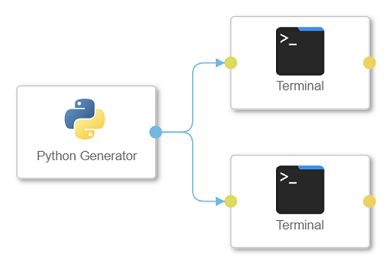
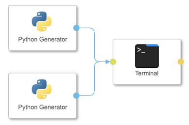
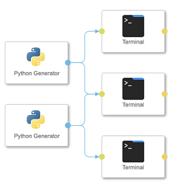

<!-- loiod89a54fc07b64d6580467008e6529251 -->

# Native Multiplexing for Gen2 Pipelines

Connect to multiple ports in a pipeline, such as one to many or many to one, without having to implement multiplexing with a script operator or other predefined operator.

When you use Generation 1 pipelines, you use Multiplexer operators to connect to an output or input port of one operator with several input or output ports of another operator. In Generation 2 pipelines, multiplexing is natively built into the Python and main subengines. Therefore, you don't need to use additional Muliplexer operators in Generation 2 pipelines.

> ### Note:  
> Native multiplexing is available for Generation 2 pipelines only, and only in SAP Data Intelligence Cloud version 2022.21 and higher. Multiplexing works in the Python and main subengines only.

For Generation 2 pipelines, you can still use the Python multiplexer to create a python script for multiplexing when necessary.

<a name="loiod89a54fc07b64d6580467008e6529251__section_zhj_w4l_lvb"/>

## Supported Connections

Native multiplexing for Generation 2 pipelines works for the following types of connections:

**One to many: 1:n**

In the following pipeline, the Python Generator has one output port that leads to two separate Terminal operators. Therefore, the Python Generator has multiple output ports. Each of the terminals has one input connection.

**Many to one: n:1**

In the following pipeline, each of the Python Generator operators have one output port. The input port of the Terminal operator receives data from the output ports of two \(multiple\) Python operators.

**Many to many: m:n**

In the following pipeline, each of the Python Genererator operators sends data to multiple Terminal operators. The input ports of each of the Terminal operators receives data from the output ports of two \(multiple\) Python Generator Operators.

-   **[Multiplexing Scenarios](multiplexing-scenarios-316c063.md "When you create Generation 2 pipelines using the native multiplexing feature, you must be aware of situations when multiplexing works, or
		when it results in errors. ")**  
When you create Generation 2 pipelines using the native multiplexing feature, you must be aware of situations when multiplexing works, or when it results in errors.

