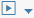

<!-- loiocb46d5f75e3546bda095c3a30a63934e -->

# Schedule Graph Executions

The SAP Data Intelligence Modeler provides capabilities to schedule graph executions.

<a name="loiocb46d5f75e3546bda095c3a30a63934e__context_trk_qt4_fhb"/>

## Context

Scheduling graph execution is useful when you have to schedule graph executions with recurring conditions.

> ### Note:  
> We recommend scheduling executions only for those graphs that, when executed, run for a limited period and finish with the status of *completed* or *dead* \(for example, Data Workflows operators\).

## Procedure

1.  Open the graph that you want to schedule to execute in a graph editor.

2.  In the editor toolbar, choose  \(Run\).

3.  Choose the *Schedule* menu option.

4.  Schedule a graph execution.

    In the *Schedule Graph* dialog box, define the schedule.

    1.  In the *Schedule Description* text field, provide a name for the schedule.

    2.  Select a schedule property.

        The application supports a form-based approach or a cron expression to define the schedule.

        **Schedule Property**

        <table>
        <tr>
        <th valign="top">

        Property
        
        </th>
        <th valign="top">

        Description
        
        </th>
        </tr>
        <tr>
        <td valign="top">
        
        Form
        
        </td>
        <td valign="top">
        
        Provides a form-based UI to define a condition that specifies the frequency \(or the number of occurrences\) for executing the graph.

        Select a time zone and define the frequency pattern in the schedule properties section to schedule the executions..

        The system uses the UTC equivalent of the frequency pattern that you specify to schedule the executions.

        For example, you can define a recurring condition that executes the graph every day at 9:00 AM.
        
        </td>
        </tr>
        <tr>
        <td valign="top">
        
        Expression
        
        </td>
        <td valign="top">
        
        Defines a cron expression that provides the condition for scheduling a recurring graph execution. The cron expression is a string of five fields separated by white spaces.

        The syntax for the cron expression is `Minute Hour DayOfMonth Month DayOfWeek`.
        
        </td>
        </tr>
        </table>
        

5.  Choose *Schedule*.

<a name="loiocb46d5f75e3546bda095c3a30a63934e__postreq_enh_41q_p2b"/>

## Next Steps

After creating a schedule, you can monitor the schedule within the Modeler or use the SAP Data Intelligence Monitoring application to monitor and manage all schedules.

In the bottom pane of the Modeler application, under the *Schedule* tab, you can monitor and manage the schedule. In this tab, you can view the description of the schedule and the graph execution state. If the schedule of the graph is in *active* state, the graph run is triggered. Otherwise, it is suspended. To stop a schedule, select the required graph and choose  \(Stop Process\).

> ### Note:  
> A special scheduling graph running in the SAP Data Intelligence Modeler performs the scheduled operation.

-   **[Cron Expression Format](cron-expression-format-550a347.md "Use cron expressions to define the recurrence condition that the tool uses to schedule
		the graph execution.")**  
Use cron expressions to define the recurrence condition that the tool uses to schedule the graph execution.

**Parent topic:**[Running Graphs](running-graphs-439d0a0.md "After creating a graph, you can run the graph based on the configuration defined for the graph. The Modeler application runs the operators in the graph as individual processes.")

**Related Information**  

[Automatic Graph Recovery](automatic-graph-recovery-4bf172b.md "Configure any graph to recover from failure automatically, regardless of whether the graph uses Generation 1 or Generation 2 operators.")

[Parameterize the Graph Run Process](parameterize-the-graph-run-process-f3caf16.md "Parameterize the graph run process using parameters that assume different values based on the values passed in each graph run.")

[Debug Graphs](debug-graphs-06b0159.md "You can start the graph in debug mode to verify the input and output from each operator during execution and analyze or modify the data passing through a connection.")

[Working with the Data Workflow Operators](../working-with-dataworkflow-operators/working-with-the-data-workflow-operators-f3f4333.md "SAP Data Intelligence Modeler has a category of operators called Data Workflow operators. When used in a graph (pipeline) and executed, the Data Workflow operators run for a limited time and finish with the status of either “completed” or “dead”.")

[Monitoring SAP Data Intelligence](../dataintelligence-monitoring/monitoring-sap-data-intelligence-5413074.md "SAP Data Intelligence provides a stand-alone monitoring application to monitor the status of graphs run in the Modeler. The Monitoring application provides capabilities to visualize the summary of graphs run in the SAP Data Intelligence Modeler with relevant charts.")

