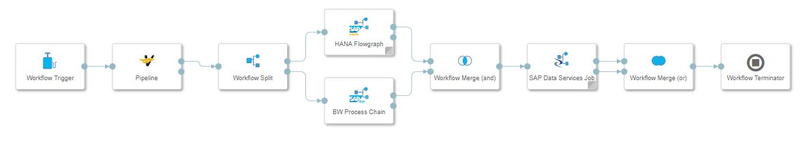

<!-- loioc7723e3a10f94a74b15f925b3d9eeda5 -->

# Control Flow of Execution

SAP Data Intelligence provides the data workflow operators Workflow Merge \(or\), Workflow Merge \(and\), and Workflow Split to control the flow of execution in a data workflow.

A typical use case for these data workflow operators is parallel executions within a data workflow.

> ### Note:  
> You can connect the input ports of the operators to other data workflow operators. But, if the operator receives a message at any of its input ports, then leaving the output ports unconnected results in a data workflow execution to fail or stop.

<table>
<tr>
<th valign="top">

Operator

</th>
<th valign="top">

Description

</th>
</tr>
<tr>
<td valign="top">

Workflow Merge \(or\)

</td>
<td valign="top">

A message is sent to the output port once the operator receives a message at any of its input ports. All further inputs are ignored.

The operator has two input ports and one output port.

</td>
</tr>
<tr>
<td valign="top">

Workflow Merge \(and\)

</td>
<td valign="top">

This operator sends a message to the output port once it receives a message on both the input ports. The process shuts down after sending the message.

The Workflow Merge \(and\) operator is intended to control the flow of execution when there are parallel executions within the data workflow.

The operator has two input ports and one output port. Leaving the output port unconnected results in a data workflow execution failure once the operator receives an input message.

</td>
</tr>
<tr>
<td valign="top">

Workflow Split

</td>
<td valign="top">

This operator helps duplicate an input message into two output messages.

The Workflow Split operator is intended to control the flow of execution when there are parallel executions within the graph.

The operator has one input port and two output ports. The operator sends the message at the input port to both the output ports.

</td>
</tr>
</table>

These operators are listed in the SAP Data Intelligence Modeler under the Data Workflow category.

> ### Note:  
> Use the operators Workflow Split, Workflow Merge \(and\), and Workflow Merge \(or\) operators in a graph with other data workflow operators only.

<a name="loioc7723e3a10f94a74b15f925b3d9eeda5__section_spx_k3x_k2b"/>

## Example

> ### Example:  
> The following data workflow uses the Workflow Split, Workflow Merge \(and\), and Workflow Merge \(or\) operators.
> 
> 
> 
> After the engine executes the Pipeline operator successfully, the Modeler duplicates the output message to both the HANA Flowgraph operator and the BW Process Chain operator. Therefore, both the HANA Flowgraph and BW Process Chain operators run in parallel.
> 
> The Workflow Merge \(and\) operator ensures that the data workflow sends a message to the SAP Data Services operator only if both the operators have finished successfully. The Workflow Merge \(or\) operator takes the first incoming message and forwards it to the Workflow Terminator operator that shuts down the data workflow execution.

