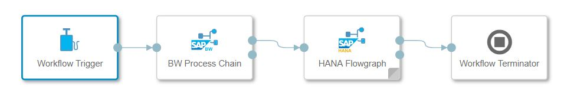
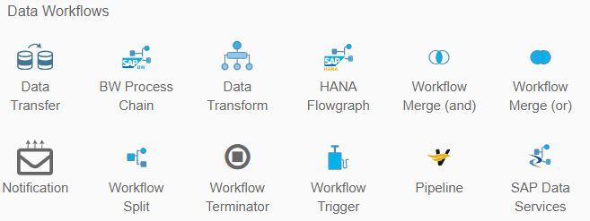

<!-- loiof3f43330514a4f66b8564364c4f5ef2a -->

# Working with the Data Workflow Operators

SAP Data Intelligence Modeler has a category of operators called Data Workflow operators. When used in a graph \(pipeline\) and executed, the Data Workflow operators run for a limited time and finish with the status of either “completed” or “dead”.

Graphs with Data Workflow operators are known as data workflows. The operators in a data workflow communicate through signals that are transferred at their input and output ports. All Data Workflow operators, except for the Workflow Trigger and Workflow Terminator operators, have an input, an output, and an error port. Thus, the operator begins to execute only when it receives a signal at its input port. The Modeler begins the execution of other connected operators in the data workflow only after the previous operator has finished its execution.

> ### Note:  
> SAP recommends that you don't model graphs that have both Data Workflow operators and non-Data Workflow operators.

> ### Example:  
> In the following data workflow, the Workflow Trigger operator sends a start execution signal to the BW Process Chain operator. Only after the BW Process Chain operator has completed successfully does the SAP HANA Flowgraph operator start to run.
> 
> 
> 
> > ### Note:  
> > If the graph sends an outgoing signal to the output port, but the output port isn't connected, the graph execution fails.

<a name="loiof3f43330514a4f66b8564364c4f5ef2a__section_d4k_fkp_d2b"/>

## Data Workflow Operators

Access the Data Workflow operators in the *Operators* tab in the Modeler navigation pane. The Modeler groups these operators under the Data Workflows category. The following Data Workflow operators are supported in the Modeler.

> ### Note:  
> For a description of each operator, hover your mouse over each operator icon, or consult the table after the image.

**Supported Data Workflow Operators**

<table>
<tr>
<th valign="top">

Operator

</th>
<th valign="top">

Description

</th>
</tr>
<tr>
<td valign="top">

BW Process Chain

</td>
<td valign="top">

Executes an SAP Business Warehouse process chain in a remote SAP BW system.

</td>
</tr>
<tr>
<td valign="top">

Data Transfer

</td>
<td valign="top">

Transfers data from an SAP BW or SAP HANA system to supported cloud storages.

</td>
</tr>
<tr>
<td valign="top">

Data Transform

</td>
<td valign="top">

Provides a variety of options for data transformation.

</td>
</tr>
<tr>
<td valign="top">

SAP HANA Flowgraph

</td>
<td valign="top">

Executes an SAP HANA flowgraph in a remote SAP HANA system.

</td>
</tr>
<tr>
<td valign="top">

Notification

</td>
<td valign="top">

Sends e-mail notifications.

</td>
</tr>
<tr>
<td valign="top">

Pipeline

</td>
<td valign="top">

Executes an SAP Data Intelligence graph on either a remote system or the local system.

</td>
</tr>
<tr>
<td valign="top">

SAP Data Services Job

</td>
<td valign="top">

Executes an SAP Data Services job in a remote SAP Data Services system.

</td>
</tr>
<tr>
<td valign="top">

Workflow Merge \(and\)

</td>
<td valign="top">

Combines the output from two Data Workflow operators in a "logical AND".

</td>
</tr>
<tr>
<td valign="top">

Workflow Merge \(or\)

</td>
<td valign="top">

Combines the output from two Data Workflow operators in a "logical OR".

</td>
</tr>
<tr>
<td valign="top">

Workflow Split

</td>
<td valign="top">

Duplicates the incoming signal from a Data Workflow operator.

</td>
</tr>
<tr>
<td valign="top">

Workflow Terminator

</td>
<td valign="top">

Terminates the current data workflow graph.

</td>
</tr>
<tr>
<td valign="top">

Workflow Trigger

</td>
<td valign="top">

Sends a start signal to trigger the execution of a data workflow graph.

</td>
</tr>
</table>

<a name="loiof3f43330514a4f66b8564364c4f5ef2a__section_brx_qnp_d2b"/>

## Modeling Data Workflows

A data workflow must have a Workflow Trigger operator as the first operator and a Workflow Terminator operator as the last operator.

-   The Workflow Trigger operator sends the start execution signal to the connected operator.
-   The Workflow Terminator operator shuts down the data workflow graph.

If you're using operators to perform actions in remote systems, then first create a connection to the remote system using the SAP Data Intelligence Connection Management application. For more information on how to create a connection, see the *Administration Guide*.

<a name="loiof3f43330514a4f66b8564364c4f5ef2a__section_sbx_hfq_d2b"/>

## Execution Logic and Data Workflow Status

Each operator in a data workflow starts running after receiving a signal at its input port. After the operator runs successfully, it sends a signal to the connected operator through its output port. If the operator doesn't complete successfully, it sends a signal to its error port.

If the port to which the message is being sent is connected to another Data Workflow operator, the operator that receives the signal begins running. If the port to which the signal is being sent isn't connected to another operator, the overall execution of the data workflow stops with the status of “dead”.

> ### Tip:  
> To design the data workflow execution to fail when any operator execution fails, model the data workflow so that the respective error ports aren't connected.

<a name="loiof3f43330514a4f66b8564364c4f5ef2a__section_qhb_pst_42b"/>

## Importing Certificates for Remote Systems

For operators that use HTTPS as the underlying transport protocol \(using TLS transport encryption\), the upstream system must have a trusted certificate. To import a certificate into the trust chain, obtain the certificates from the target system and import them using the SAP Data Intelligence Connection Management application. The next execution of the graph involving the HTTPS connection picks up any certificate that is present in the trust chain automatically. For more information on how to create a connection, see the *Administration Guide*.

> ### Remember:  
> SAP Data Intelligence assumes that the imported certificates are for all of its applications. SAP Data Intelligence doesn't restrict the certificates for use only for the Data Workflow operators.

> ### Note:  
> Adding any certificate overwrites the default chain of trust. Thus, the engine can require that you add further certificates for the existing graphs to continue working.

-   **[Workflow Trigger and Workflow Terminator](workflow-trigger-and-workflow-terminator-8084d07.md "The operators Workflow Trigger and Workflow Terminator control the beginning and ending of a
		data workflow graph (pipeline). ")**  
The operators *Workflow Trigger* and *Workflow Terminator* control the beginning and ending of a data workflow graph \(pipeline\).
-   **[Run an SAP BW Process Chain Operator](run-an-sap-bw-process-chain-operator-dd9357c.md "To run (execute) an SAP Business Warehouse (BW) process chain in an SAP BW system, use the BW Process Chain operator in the SAP Data Intelligence Modeler application.")**  
To run \(execute\) an SAP Business Warehouse \(BW\) process chain in an SAP BW system, use the BW Process Chain operator in the SAP Data Intelligence Modeler application.
-   **[Run a HANA Flowgraph Operator](run-a-hana-flowgraph-operator-429c135.md "To run (execute) an SAP HANA Flowgraph in an SAP HANA system, use the HANA flowgraph operator in the SAP Data Intelligence Modeler application.")**  
To run \(execute\) an SAP HANA Flowgraph in an SAP HANA system, use the HANA flowgraph operator in the SAP Data Intelligence Modeler application.
-   **[Run an SAP Data Intelligence Pipeline](run-an-sap-data-intelligence-pipeline-69bbcf9.md "Use the Pipeline operator in the SAP Data Intelligence Modeler application to run (execute) a graph (pipeline) in an SAP Data Intelligence system.")**  
Use the Pipeline operator in the SAP Data Intelligence Modeler application to run \(execute\) a graph \(pipeline\) in an SAP Data Intelligence system.
-   **[Run an SAP Data Services Job](run-an-sap-data-services-job-01bbb48.md "Use the SAP Data Services Job operator in the SAP Data Intelligence Modeler application to run (execute) an SAP Data Services job in a remote system.")**  
Use the SAP Data Services Job operator in the SAP Data Intelligence Modeler application to run \(execute\) an SAP Data Services job in a remote system.
-   **[Transfer Data](transfer-data-b250a0b.md "The Data Transfer operator allows you to transfer data from specific source systems to specific target systems.")**  
The Data Transfer operator allows you to transfer data from specific source systems to specific target systems.
-   **[Control Flow of Execution](control-flow-of-execution-c7723e3.md "SAP Data Intelligence provides the data workflow
		operators Workflow Merge (or), Workflow Merge (and), and Workflow Split to control the flow of execution in a data workflow. ")**  
SAP Data Intelligence provides the data workflow operators Workflow Merge \(or\), Workflow Merge \(and\), and Workflow Split to control the flow of execution in a data workflow.
-   **[Send E-Mail Notifications](send-e-mail-notifications-43e3eac.md "Use the Notification operator in the SAP Data Intelligence Modeler to send e-mail notifications to users at certain points during the data workflow
		execution.")**  
Use the Notification operator in the SAP Data Intelligence Modeler to send e-mail notifications to users at certain points during the data workflow execution.

**Related Information**  

[Using SAP Data Intelligence System Management](https://help.sap.com/viewer/300d97f4d57c4b329df8c83858ff67fb/Dev/en-US/76e7a1faa64f408e9e72dc2fa4071964.html "The SAP Data Intelligence System Management application allows you to manage applications, users, and files. It provides the initial point of access to the user-facing applications running on its server.") :arrow_upper_right:

[Create a Connection](https://help.sap.com/viewer/300d97f4d57c4b329df8c83858ff67fb/Dev/en-US/e259041c90734cb688e13a7931e7d721.html "Create a connection in SAP Data Intelligence, which represents an access point to a remote system or a remote data source.") :arrow_upper_right:

[Manage Certificates](https://help.sap.com/viewer/300d97f4d57c4b329df8c83858ff67fb/Dev/en-US/95b577f233ea4546ac7620b607fd1f70.html "Use the SAP Data Intelligence Connection Management application to manage certificates for remote systems.") :arrow_upper_right:

