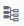
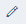

<!-- loiob89f90fa79c64faa8d86a6142199a4f4 -->

# Configure the Aggregation Node

An Aggregation node represents a relational group-by and aggregation operation.

<a name="loiob89f90fa79c64faa8d86a6142199a4f4__prereq_o3f_hjt_b1b"/>

## Prerequisites

You have defined the operator with an Aggregation node and connected the previous node to this node.

<a name="loiob89f90fa79c64faa8d86a6142199a4f4__steps_klq_g45_wlb"/>

## Procedure

1.  Double-click the *Aggregation* node.

2.  Define the output columns.

    If you have connected the previous node to the Aggregation node, you can map any columns from the input as output columns of the Aggregation node. You can add, delete, and rename the columns, as needed.

    1.  In the *Mapping* pane, select a *Source* column and drag and drop it into the *Drop row here* zone in the *Target* section.

        > ### Note:  
        > You can also duplicate an output column \(map the same source column more than once\). Select the required *Source* column and drag and drop it into the *Drop row here* zone in the *Target* section.

    2.  **Optional:** If you want to automatically map the columns based on column names, in the *Source* section, choose  \(Auto Map by Name\).

    3.  If you want to edit a column name, select a *Target* column and choose  \(Edit\).

    4.  If you want to remap an output column with a different source column, right-click the mapping and choose *Remap*.

        Select a new source column and choose *OK*.

3.  Define the aggregation type.

    You can specify the columns that you want to have the aggregate or group-by actions taken upon.

    1.  If you want to define an aggregation type, select a *Target* column and choose  \(Edit\).

    2.  In the *Aggregation Type* dropdown list, select a value.

        <table>
        <tr>
        <th valign="top">

        Aggregation Type
        
        </th>
        <th valign="top">

        Description
        
        </th>
        </tr>
        <tr>
        <td valign="top">
        
        <empty\>
        
        </td>
        <td valign="top">
        
        Specifies a list of columns for which you want to combine output. For example, group sales orders by date to find the total sales ordered on a particular date. This type is the default aggregation type.
        
        </td>
        </tr>
        <tr>
        <td valign="top">
        
        Avg
        
        </td>
        <td valign="top">
        
        Calculates the average of a given set of column values.
        
        </td>
        </tr>
        <tr>
        <td valign="top">
        
        Count
        
        </td>
        <td valign="top">
        
        Returns the number of values in a table column.
        
        </td>
        </tr>
        <tr>
        <td valign="top">
        
        Max
        
        </td>
        <td valign="top">
        
        Returns the maximum value from a list.
        
        </td>
        </tr>
        <tr>
        <td valign="top">
        
        Min
        
        </td>
        <td valign="top">
        
        Returns the minimum value from a list.
        
        </td>
        </tr>
        <tr>
        <td valign="top">
        
        Sum
        
        </td>
        <td valign="top">
        
        Calculates the sum of a given set of values.
        
        </td>
        </tr>
        </table>
        

4.  **Optional:** Reorder output columns.

    In the *Columns* tab toolbar, switch to the *Form* pane to reorder the output columns.

    1.  To reorder the columns, select the column that you want to move and in the toolbar click the up or down arrows.

5.  Add and connect new nodes.

    If you want to configure the Data Transform operator with another node, follow these steps:

    1.  In the menu bar, use the breadcrumb navigation to go back to the node editor.

    2.  Add new nodes.

    3.  To connect the nodes, select the output port of a node and drag the cursor to an input port of another node.

6.  Define data target.

    It is necessary to create a data target to the node and create an output port for Data Transform operator.

    1.  Right-click the output port of the node and select *Create Data Target*.

