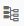
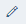

<!-- loioe06ffa4eaf24404f9a4a1d5b5a8e3a4e -->

# Configure the Projection Node

A Projection node represents a relational selection \(filter\) combined with a projection operation. It also allows calculated attributes to be added to the output.

<a name="loioe06ffa4eaf24404f9a4a1d5b5a8e3a4e__prereq_o3f_hjt_b1b"/>

## Prerequisites

You have defined the operator with a Projection node and connected the previous node to this node.

<a name="loioe06ffa4eaf24404f9a4a1d5b5a8e3a4e__steps_mzk_zfr_rw"/>

## Procedure

1.  Double-click the *Projection* node.

2.  Define the output columns.

    If you have connected the previous node to the Projection node, you can map any columns from the input as output columns of the Projection node. You can also add, delete, and rename the columns, as needed.

    1.  In the *Mapping* pane, select a *Source* column and drag and drop into the *Drop row here* zone in the *Target* section.

        > ### Note:  
        > You can also duplicate an output column \(map the same source column more than once\). Select the required *Source* column and drag and drop into the *Drop row here* zone in the *Target* section.

    2.  **Optional:** To automatically map the columns based on column names, in the *Source* section, choose  \(Auto Map by Name\).

    3.  **Optional:** To add new output columns, in the *Target* section, choose *\+* \(Add Column\) to add new rows and define its data type.

        > ### Note:  
        > For all new output columns, define the output column with a column expression or with a mapping to any of the existing source columns.

    4.  **Optional:** To use an expression to define an output column, click the required *Target* column and then define the output column expression in the expression editor.

    5.  **Optional:** To remap an output column with a different source column, right-click the mapping, choose *Remap*, select a new source column, and choose *OK*.

    6.  **Optional:** To edit a column name or its data type, select a *Target* column and choose  \(Edit\).

    7.  **Optional:** To delete a mapping without deleting the output column, right-click the mapping and choose *Delete*.

3.  **Optional:** Define additional configurations for output columns.

    In the *Columns* tab toolbar, switch to the *Form* pane to define additional configurations for output columns.

    1.  If you have identical records from the previous node, in the toolbar, select the *Distinct* checkbox to output unique records only.

        > ### Remember:  
        > The duplicate records must match exactly; similar records are included to the output. For example, if the only difference between record 1 and record 2 is that the first name is spelled "Jane" and "Jayne" respectively, then both records are output.

    2.  If you want to add new output columns by duplicating an existing output column definition, select an output column and in the toolbar, choose .

    3.  Under the *Primary Key* column, select an output column that serves as the primary key.

        Typically the data in this column is unique.

    4.  Under the *Nullable* column, choose whether the column value can be empty \(nullable\).

    5.  To reorder the columns, select the column that you want to move and in the toolbar click the up or down arrows.

4.  **Optional:** Define filters.

    For example, if you want to move all the records that are in Canada for the year 2017, your filter might look like the following: "Filter1\_input"."COUNTRY" = 'Canada' AND "Filter1\_input"."DATE"='2017'

    1.  Select the *Filter* tab to compare the column name against a constant value.

    2.  In the expression editor, enter the required expression.

        > ### Tip:  
        > Use the *SQL Helper*, choose whether to select the required columns, functions, or operators to the expression editor. Double-click the columns, operators, or functions to include them in the expression editor. For more information on each function, see the "SQL Functions" topic in the *SAP HANA SQL and System Views Reference* guide.

5.  Add and connect new nodes.

    If you want to configure the Data Transform operator with another node:

    1.  In the menu bar, use the breadcrumb navigation to go back to the node editor.

    2.  **Optional:** Add new nodes.

    3.  To connect the nodes, select the output port of a node and drag the cursor to an input port of another node.

6.  Define data target.

    It is necessary to create a data target to the node and create an output port for Data Transform operator.

    1.  Right-click the output port of the node and select *Create Data Target*.

