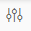

<!-- loio8fe8c0209652437994d5a79f5b95b361 -->

<link rel="stylesheet" type="text/css" href="../css/sap-icons.css"/>

# Data Transform

The Data Transform operator in the SAP Data Intelligence Modeler provides wide variety of options to meet your data transformation needs.

<a name="loio8fe8c0209652437994d5a79f5b95b361__context_dcv_k5m_tdb"/>

## Context

This operator allows you to perform data transformations, such as projection, union, aggregation, and join. It can connect to other operators from the Structured Data Operators category as sources and targets. There are nodes available in the operator that provide capabilities to meet your data transformation requirements. For example, you can use these nodes to create projections and joins. Configure each node to meet your individual data specifications.

<a name="loio8fe8c0209652437994d5a79f5b95b361__steps_stg_qqx_jlb"/>

## Procedure

1.  Start the SAP Data Intelligence Modeler.

2.  In the navigation pane, select the *Graphs* tab.

3.  Choose :heavy_plus_sign: \(Create Graph\).

    The application opens an empty graph editor in the same window where you can define your graph. A graph can contain a single operator or a network of operators based on the business requirement.

4.  In the *Operators* tab, select any consumer operator. For example, double-click the *Structured File Consumer* operator \(or drag and drop it to the graph editor\) to add it as a process in the graph execution.

5.  Select the operator and choose  \(Open Configuration\) to define the required configurations to the operator.

    > ### Note:  
    > -   For consumer operators \(Structured File Consumer, Table Consumer, and Application Consumer\) you can use the *Data Preview* option in the configuration panel to view the content of the selected file or table. If the table is very wide or contains a number of large column types, the result may be truncated in order to avoid out of memory issues.
    > -   The file browsing and data preview is not possible if substitution parameters are used to configure the connection ID or the table name properties.
    > 
    >     For CSV files, you can modify the CSV properties using :pencil2: and view data accordingly.

6.  Add the Data Transform operator to the graph.

7.  Connect the output port of the *Structured File Consumer* operator to the *Data Transform* operator.

8.  In the graph editor, double-click the *Data Transform* operator.

9.  In the *Nodes* tab, drag and drop the required node to the operator editor.

    The Data Transform operator provides different nodes that you can use to define your data transformation requirements.

    <table>
    <tr>
    <th valign="top">

    Node
    
    </th>
    <th valign="top">

    Description
    
    </th>
    </tr>
    <tr>
    <td valign="top">
    
    Projection
    
    </td>
    <td valign="top">
    
    Represents a relational selection \(filter\) combined with a projection operation. It also allows calculated columns to be added to the output.
    
    </td>
    </tr>
    <tr>
    <td valign="top">
    
    Join
    
    </td>
    <td valign="top">
    
    Represents a relational multiway join operation. It supports multiple input ports.
    
    </td>
    </tr>
    <tr>
    <td valign="top">
    
    Aggregation
    
    </td>
    <td valign="top">
    
    Represents a relational group-by and aggregation operation.
    
    </td>
    </tr>
    <tr>
    <td valign="top">
    
    Union
    
    </td>
    <td valign="top">
    
    Represents a relational union operation. It supports multiple input ports.
    
    </td>
    </tr>
    <tr>
    <td valign="top">
    
    Case
    
    </td>
    <td valign="top">
    
    Specifies multiple paths so that the rows are separated and processed in different ways.
    
    </td>
    </tr>
    </table>
    
10. Double-click the node and define the required node configurations. For more information on configuring the data transform nodes, see the Related Information section.

11. In the menu bar, use the breadcrumb navigation to navigate back to the operator configuration editor.

12. Add any producer operator. For example, add the Structured File Producer operator to the graph editor.

13. Connect the output port of the *Data Transform* operator to the *Structured File Producer* operator.

14. Define the required configurations to the Structured File Producer operator.

15. To control the start and stop of the graph execution, add the Workflow Trigger and the Graph Terminator operators at the beginning and at the end of the graph, respectively.

16. Save and execute the graph.

    > ### Tip:  
    > You can also schedule the graph execution. For more information, see [Schedule Graph Executions](../using-graphs/schedule-graph-executions-cb46d5f.md).

-   **[Configure the Projection Node](configure-the-projection-node-e06ffa4.md "A Projection node represents a relational selection (filter) combined with a projection operation. It also allows calculated attributes
		to be added to the output.")**  
A Projection node represents a relational selection \(filter\) combined with a projection operation. It also allows calculated attributes to be added to the output.
-   **[Configure the Join Node](configure-the-join-node-be68835.md "A Join node represents a relational multiway join operation.")**  
A Join node represents a relational multiway join operation.
-   **[Configure the Aggregation Node](configure-the-aggregation-node-b89f90f.md "An Aggregation node represents a relational group-by and aggregation operation.")**  
An Aggregation node represents a relational group-by and aggregation operation.
-   **[Configure the Union Node](configure-the-union-node-f696fe5.md "A Union node represents a relational union operation.")**  
A Union node represents a relational union operation.
-   **[Configure the Case Node](configure-the-case-node-6b7d6b4.md "The Case node specifies multiple paths so that the rows are separated and processed in
		different ways.")**  
The Case node specifies multiple paths so that the rows are separated and processed in different ways.

