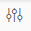

<!-- loiob865f5a18cc84a99b8ed42f2e8af0b1a -->

<link rel="stylesheet" type="text/css" href="../css/sap-icons.css"/>

# Structured Table Producer

The Structured Table Producer operator receives data from any structured operators, and produces a table in the specified database.

<a name="loiob865f5a18cc84a99b8ed42f2e8af0b1a__steps_stg_qqx_jlb"/>

## Procedure

1.  Start the SAP Data Intelligence Modeler.

2.  In the navigation pane, select the *Graphs* tab.

3.  Choose :heavy_plus_sign: \(Create Graph\).

    The application opens an empty graph editor in the same window, where you can define your graph. A graph can contain a single operator or a network of operators based on the business requirement.

4.  In the *Operators* tab, double-click the *Structured Table Producer* operator \(or drag and drop it to the graph editor\) to add it as a process in the graph.

5.  Add any consumer operator from the Structured Data Operators category to the graph. To know more about configuring consumer operators, See [Structured Consumer Operators](structured-consumer-operators-abd02a9.md).

6.  Connect the output port of the consumer operator to the *Structured Table Producer* operator.

7.  To open the custom editor of the *Structured Table Producer* operator, double-click the operator.

8.  Configure the Service, Connection, and Target properties.

    1.  To create new target within an existing schema, click :heavy_plus_sign: in the *Browse* dialog. The columns will be copied from the source consumer operator to the new target..

9.  Choose a write mode:

    -   Append: Add data to an existing table. In this mode, you can choose to perform an upsert. Select the checkbox *Update Records By Primary Key \(Upsert\)*.
    -   Overwrite: Drop the table and create another one according to the source schema.
    -   Truncate: Clear the table before inserting data.
    -   Delete: Delete records from the target where values of the mapped target columns match with the source column.

        > ### Caution:  
        > Existing column mappings will be cleared once you switch to delete mode from any other mode.

        > ### Note:  
        > Delete mode is not available for HDL database connection.

10. You can map source and target columns if not automatically mapped.

    > ### Note:  
    > -   Use the *Data Preview* option to see the output data. If the table is very wide or contains a number of large column types, the result may be truncated in order to avoid out of memory issues.
    > -   The file browsing and data preview is not possible if substitution parameters are used to configure the connection ID or the table name properties.

11. In the graph editor, select the operator and choose  \(Open Configuration\) to define the other required configurations of the operator.

12. To stop running the graph, add the Graph Terminator operator at the end of the graph.

13. Connect the output port of the producer operator to the Graph Terminator operator.

14. Save and execute the graph.

